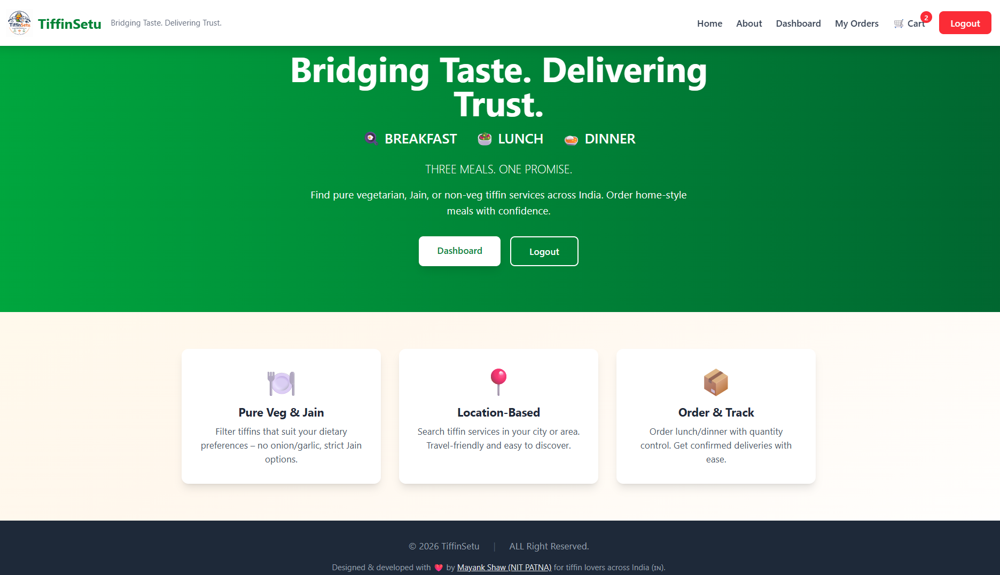
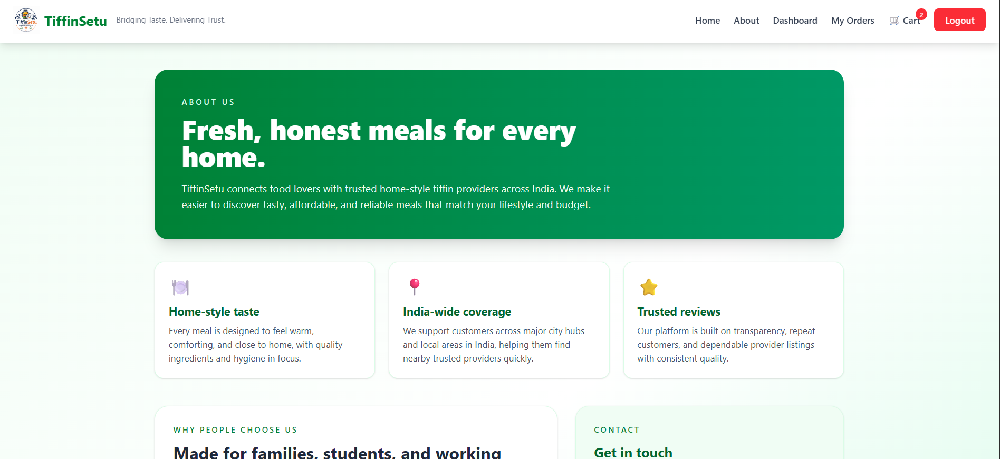
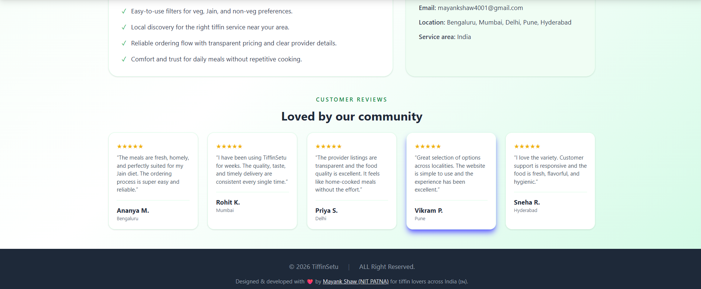
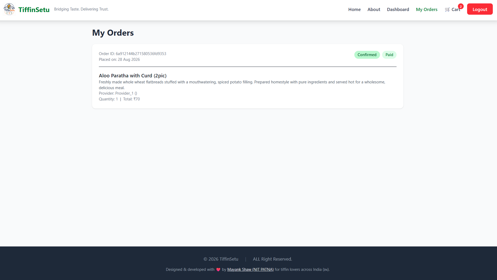
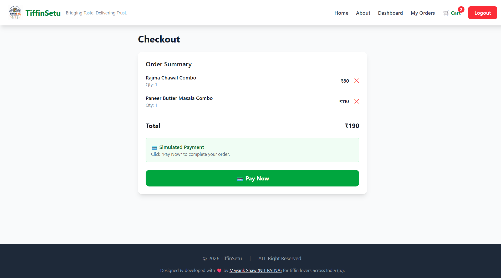
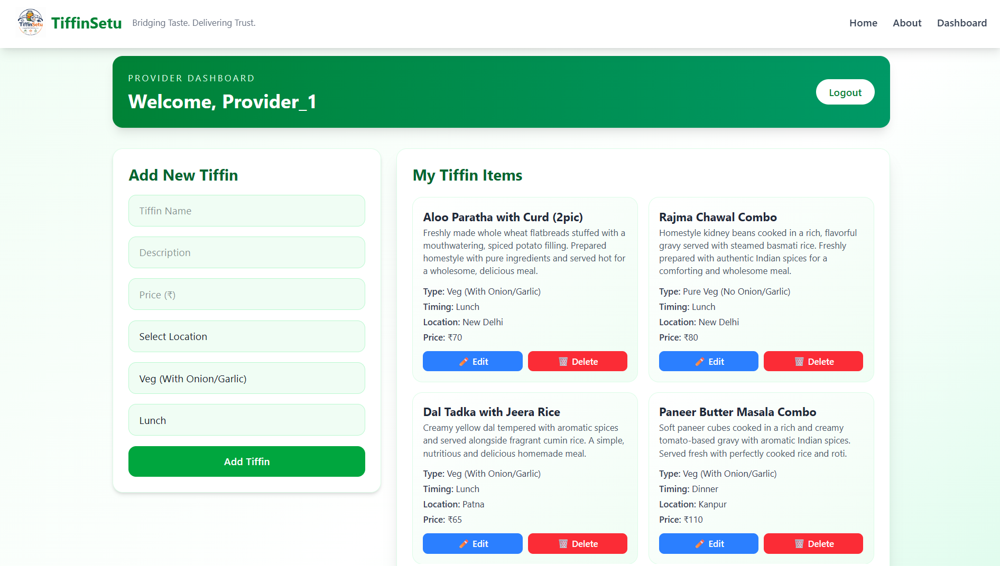

<!--
TiffinSetu/
├── screenshots/
│   ├── landing.png
│   ├── customer-dashboard.png
│   ├── orders-page.png
│   ├── cart-page.png
│   ├── provider-dashboard.png
│   └── about-page.png
├── backend/
├── frontend/
└── README.md
-->
# 🍱 TiffinSetu

**Bridging Taste. Delivering Trust.**  
*A full‑stack tiffin delivery platform with authentication, role‑based dashboards, and CI/CD.*

[](https://reactjs.org/)
[](https://nodejs.org/)
[](https://www.mongodb.com/)
[](https://www.docker.com/)
[](https://aws.amazon.com/ec2/)
[](https://github.com/features/actions)

---

## 📌 Project Overview

**TiffinSetu** connects **customers** with **tiffin service providers** across India.  
It enables users to discover and order meals based on dietary preferences (Pure Veg, Jain, Non‑Veg), manage carts, and track order history – all with a seamless, role‑based experience.

> **🌐 Live Demo:** [http://your-ec2-ip](http://your-ec2-ip) *(Replace with your actual IP)*

---

## 🧰 System Specifications

| Category | Technology / Tool |
| :--- | :--- |
| **Frontend** | React.js (Vite), Tailwind CSS, Axios |
| **Backend** | Node.js, Express.js, JWT, bcryptjs |
| **Database** | MongoDB (Atlas / Local), Mongoose ODM |
| **Containerization** | Docker, Docker Compose |
| **Cloud Infrastructure** | AWS EC2 (Ubuntu 22.04) |
| **CI/CD Pipeline** | GitHub Actions, Docker Hub |
| **Authentication** | JSON Web Tokens (JWT) |
| **API Testing** | RESTful APIs with Postman / cURL |

---

## ✨ Key Features

### 👤 Customer Module
- 🔐 Secure JWT‑based authentication (Register / Login)
- 🍽️ Search & filter tiffins by **Location**, **Food Type**, and **Timing**
- 🛒 Add items to **Cart** with dynamic quantity control
- 📦 Place orders with simulated payment flow
- 📋 View full **Order History** with status tracking (Pending, Confirmed, Cancelled)
- ❌ Cancel pending orders

### 🏪 Provider Module
- ➕ Add, edit, and delete tiffin items
- 📍 Manage location, pricing, food type, and meal timings
- 📊 View all menu items in a structured dashboard

### ⚙️ Infrastructure & DevOps
- 🐳 **Containerized** using Docker Compose for consistent environments
- ☁️ **Deployed** on AWS EC2 with security groups and reverse proxy
- ⚡ **CI/CD** via GitHub Actions – automatic build & deploy on every `git push`

---

## 🖼️ Screenshots

### Landing Page
| Landing Page |
| :---: | :---: |
|  | 

### About Page (Part 1 & 2)

| About Section 1 | About Section 2 |
| :---: | :---: |
|  |  |

### Customer Dashboard & Orders
| Customer Dashboard | Orders Page |
| :---: | :---: |
|  |  |

### Cart Page & Provider Dashboard
| Cart Page | Provider Dashboard |
| :---: | :---: |
|  |  |

---

## 🏗️ Architecture Overview

```mermaid
graph TD
    A[Client Browser] -->|HTTP / REST| B[React.js Frontend]
    B -->|API Calls| C[Node.js / Express Backend]
    C -->|Read/Write| D[MongoDB Database]
    C -->|JWT Auth| E[Authentication Service]
    C -->|Deployment| F[AWS EC2]
    G[GitHub Actions] -->|Build & Push| H[Docker Hub]
    H -->|Pull & Deploy| F
